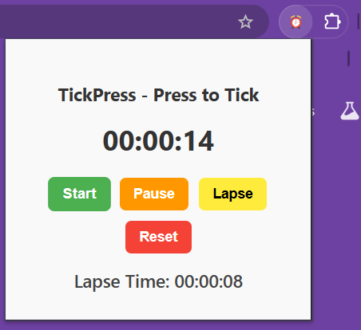

# ⏱️ TickPress – Time Tracker for Focused Work

**TickPress** is a lightweight and efficient Chrome extension designed to help users track the time they spend on solving questions, studying, or performing deep, focused tasks. Whether you're a student, coder, or competitive exam aspirant, TickPress helps you manage your time effectively.

---

## 🧩 Features

- ✅ **Start Timer** – Begin your time tracking session.
- ⏸️ **Pause Timer** – Pause the timer without losing your progress.
- 🟡 **Lapse Button** – Record and display intermediate time checkpoints.
- 🔄 **Reset Timer** – Clear the timer and start fresh.
- 📋 **Lapse Display** – View all recorded lapses inside the popup interface.

---
## Screenshots



---

## 👥 Who Is It For?

TickPress is built for:
- 🎓 Students and exam aspirants
- 💻 Coders and developers
- 📚 Anyone practicing time-bound tasks
- 🚀 Productivity-focused individuals

---

## 🛠️ Tech Stack

- HTML
- CSS (Modern, color-coded buttons)
- JavaScript (Core logic and timer)
- Chrome Extension API (Manifest V3)

---

## 📦 Installation

1. Clone the repository:
   ```bash
   git clone https://github.com/PRAVEENKUMAR-V0811/TickPress_Timer_Extension.git
2. Open Chrome and go to: chrome://extensions/

3. Enable Developer Mode (toggle in the top-right)

4. Click Load Unpacked

5. Select the project folder you just cloned

---

## 📬 Feedback & Contributions
Contributions, issues, and feature requests are welcome!
Feel free to open an issue or submit a pull request.

---

## 👨‍💻 Author
**Praveen Kumar** <br>
*B.E. Artificial Intelligence and Machine Learning* <br>
*praveenkumarv0811@gmail.com* <br>
[Portfolio](https://buildwithpraveen.vercel.app/) | [LinkedIn](https://www.linkedin.com/in/praveenkumarv08)